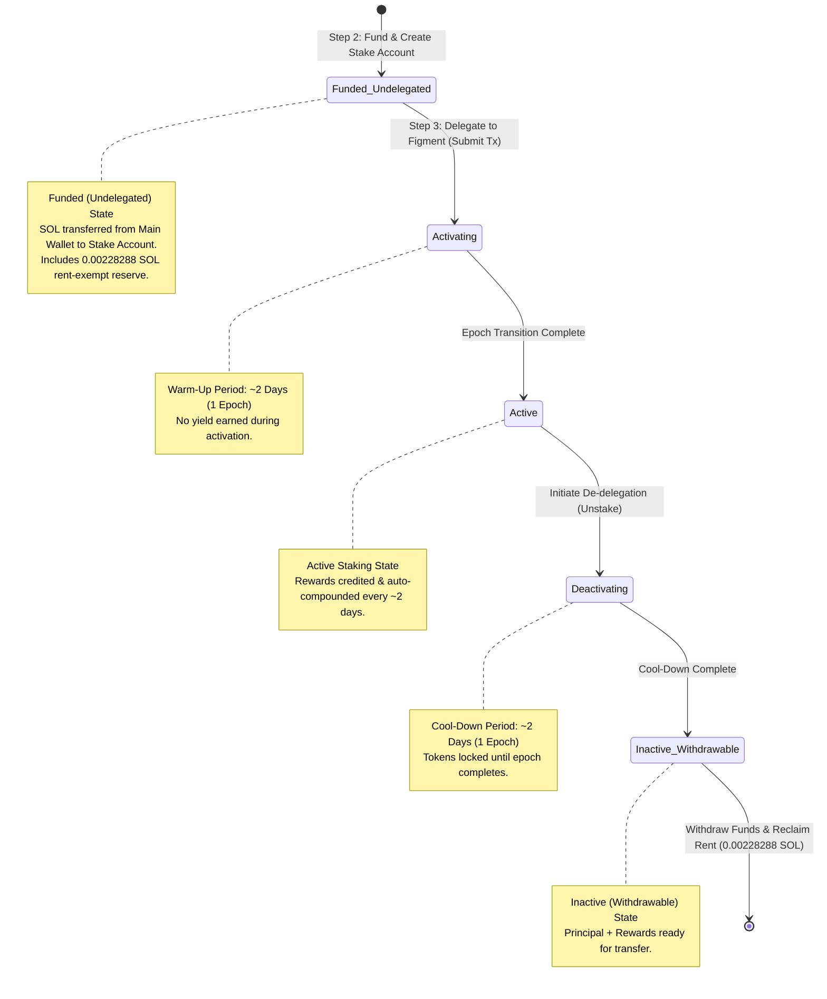

# Q2: Solana Staking Guide — Comprehensive Audit & Rewritten Guide

This document provides a **two-part technical evaluation** of Liminal's Solana Staking Guide:

1. **Part A: In-Depth Audit & Points of Improvement** — Structural, technical, and UX critique of the existing guide (`/docs/stake-solana-assets-in-liminal-vaults`).
2. **Part B: Rewritten Solana Staking Master Guide** — A redesigned, step-by-step, task-oriented user guide for Liminal Dashboard users.

---

# Part A: In-Depth Audit & Points of Improvement

After reviewing Liminal’s existing Solana Staking Guide via live MCP documentation audit, **8 critical gaps** were identified from the perspective of an institutional exchange operator using Liminal Vaults. 

Below is the structured audit matrix detailing each gap, its operational impact, and recommended remedies:

### Audit Matrix

| # | Improvement Area | Identified Gap in Original Guide | Recommended Technical & Documentation Remedy |
| :-: | :--- | :--- | :--- |
| **1** | **Prerequisites & Rent-Exempt Reserve** | Does not specify that Solana requires an exact **Rent-Exempt Minimum Reserve** (`0.00228288 SOL`, ~`0.0023 SOL`) per stake account, plus gas fee buffer (~`0.005 SOL`). Users attempting to stake 100% of their balance experience silent transaction failures. | Add a prominent **Prerequisites Checklist** explicitly detailing mandatory minimum un-staked SOL reserves (`0.00228288 SOL`) required for stake account creation and gas fees. |
| **2** | **Solana Warm-Up & Cool-Down Epoch Lifecycle** | Omits explanation of Solana's **Epoch Warm-Up** (~2 days) and **Unbonding Period** (~2-day cool-down). Users expect immediate reward generation after clicking "Stake". | Include a dedicated **Staking State Machine Diagram** explaining the `Activating` state, 2-day reward credit frequency, and epoch transition timing. |
| **3** | **Multi-Sig & Cold Vault Quorum Workflow** | Cold storage and MPC vaults require multi-signature approval. The original guide treats staking as a single-click action, confusing institutional users whose vaults require threshold signoffs from secondary keyholders. | Detail the **Multi-Sig Quorum Approval Workflow**, explaining how initiators and co-signers approve requests via the Vaults web platform and Vaults Mobile App. |
| **4** | **Validator Partner & Commission Transparency** | Lacks clarity on the integrated validator partner (**Figment**), omitting details on validator commission rates, Figment Terms of Service acceptance, and net reward yields (~6.42% APY). | Provide explicit **Figment Validator Integration** guidance, including mandatory TOS signoff, commission deduction disclosure, and yield expectations. |
| **5** | **De-delegation & Unbonding Procedure** | Focuses solely on *initiating* a stake, omitting instructions for **Unstaking (De-delegating)**, the 2-day cool-down epoch period, and withdrawing principal + rewards + rent reclamation. | Add a complete **Section for De-delegation & Withdrawals**, detailing cool-down timing and `0.00228288 SOL` rent-exempt reserve reclamation. |
| **6** | **Visual Step-by-Step UI Guidance** | Uses placeholder images or lacks clear UI screenshots with callout indicators for Liminal Vaults navigation. | Incorporate authentic **Liminal UI Screenshots** with descriptive placeholders for wallet enablement, account creation, mobile co-signing, and delegation. |
| **7** | **Rewards Calculator Tool** | Does not explain how exchange operations teams can estimate projected SOL yields prior to locking up capital. | Add a **Liminal Rewards Calculator** guide detailing inputs (Amount, Duration, Asset Price, APR %) and projected yield outputs. |
| **8** | **Troubleshooting & Error Recovery** | Contains no troubleshooting table for common UI errors (e.g. `Single staking process limit`, `Insufficient SOL for Stake Account creation`, `Pending Co-Signer Timeout`). | Add a comprehensive **Troubleshooting & Common Misconceptions** reference table at the end of the guide. |

---

# Part B: Rewritten Solana Staking Master Guide

```
DOCUMENT METADATA
Title: Staking Solana (SOL) Assets via Liminal Institutional Vaults
Audience: Exchange Operations, Custody Managers, Treasury Leads
Product: Liminal Dashboard / Vaults Staking Hub
Validator Partner: Figment
Last Updated: September 2026
```

> *Note: UI screenshots referenced in this guide are sourced from existing Liminal Vaults documentation and will update automatically upon brand/theme refreshes.*

## Overview

Liminal’s Staking Hub allows institutional exchanges to stake SOL directly from warm MPC and cold vaults. Staking SOL enables you to earn network inflation rewards (**~6.42% APY** powered by **Figment**) while retaining full multi-signature custody of your underlying private keys.

Key staking parameters:
- **Reward Rate**: ~6.42% APY (subject to network inflation dynamics and validator commission).
- **Reward Credit Frequency**: Every ~2 days (at epoch boundaries).
- **Unbonding Period**: ~2 days (cool-down epoch before withdrawal).
- **Compounding**: Rewards automatically compound within your dedicated Stake Account.

!!! note "Custody Safety & Multi-Sig Rules"
    - **No Custody Loss**: Liminal never acquires or retains custody of your staked assets at any time.
    - **Single Process Limit**: You can initiate only **one pending staking initiation request** per wallet at a time. Once approved by quorum, subsequent requests can be initiated.
    - **Immutable Stake Amount**: Once delegated, a stake account's delegated amount cannot be modified; additional stakes require creating a new staking account.

---

## Validator Partner & Commission Details

Liminal integrates natively with **Figment**, an enterprise-grade validator infrastructure provider:
- **Validator**: Figment (`Figment Validator Node`).
- **Commission Deduction**: Figment's validator commission is automatically deducted from gross network inflation rewards prior to crediting. The displayed **~6.42% APY** reflects net estimated yield.
- **Terms of Service**: Accept Figment's TOS during initial wallet enablement.

---

## Solana Rewards Calculator

Before delegating assets, you can calculate projected yields using the built-in **Liminal Rewards Calculator**:

1. Log into [Liminal Vaults](https://vaults.lmnl.app/).
2. Navigate to **Staking** > **Rewards Calculator**.
3. Fill in the parameters:
   - **Asset**: Select `SOL (Solana)`.
   - **Amount of Tokens**: Enter your intended staking volume (e.g., `1,000 SOL`).
   - **Staking Duration**: Set target lockup period (e.g., `365 Days`).
   - **Price of Asset**: Enter current market price in USD.
   - **Rewards Rate (APR %)**: Pre-populated with current Figment network yield (~6.42%), but editable for custom multi-year projection modeling.
4. The panel displays projected total rewards in both USD equivalent and native SOL.

*[UI Screenshot: Liminal Rewards Calculator Panel]*


---

## Solana Stake Account Lifecycle

Solana does not stake tokens directly from your primary vault address. Instead, Liminal creates a dedicated on-chain **Stake Account** funded by your wallet and delegates it to the Figment validator node.



---

## Prerequisites Checklist

Before initiating a Solana staking transaction, verify your vault setup:

- [x] **Staking Enabled for Org**: Confirm your organisation has enabled Solana staking with Liminal (<sales@lmnl.app>).
- [x] **Rent-Exempt Reserve**: Maintain the exact **`0.00228288 SOL`** (~`0.0023 SOL`) un-staked reserve per stake account in the main wallet.
- [x] **Gas Fee Buffer**: Preserve an additional **~0.005 SOL** (recommended **0.01 SOL** liquid balance) for multi-sig approvals, de-delegation, and withdrawal transactions.
- [x] **Signing Quorum Ready**: For MPC and multi-sig wallets, ensure required threshold initiators (Web) and signers (Vaults Mobile App) are available.

---

## Step-by-Step Staking Guide

### Step 1: Enable Staking for your Solana Wallet

Once staking is activated for your organisation, enable the SOL asset chain in Liminal Vaults:

1. Log into [Liminal Vaults](https://vaults.lmnl.app/).
2. Go to **Staking**.
3. Locate **SOL** asset and select **Start Staking**.
4. In the **Wallet** field, select your target Solana wallet.
5. Check mark the **Figment Terms of Service** agreement.
6. Select **Enable Staking**.
7. Enter your **Two-Factor Authentication (2FA)** code and select **Continue**.
8. Refresh the page to confirm the wallet is enabled for SOL staking.

*[UI Screenshot: Enable Staking for Solana Wallet]*


---

### Step 2: Create an On-Chain Staking Account (Funding Phase)

In this step, you create and fund a dedicated stake sub-account. **SOL is transferred from your main wallet into the new stake account**, including the mandatory `0.00228288 SOL` rent-exempt reserve.

1. In the **Staking** dashboard, expand the **SOL** asset row.
2. Select **Create Account**.
3. Complete the form:
   - **Amount**: Enter the SOL amount to transfer from your main wallet to the staking account.
   - **Note**: Add a transaction description for auditing purposes.
4. Select **Next** > **Sign**.

*[UI Screenshot: Create Staking Account Modal]*


5. **Multi-Sig Quorum Signoff**:
   - **Initiators**: Log into Vaults Web, find the pending transaction under **Pending Actions**, select **Approve**, and enter 2FA.
   - **Signers**: Log into the **Vaults Mobile App**, locate the notification under **Pending Approvals**, and tap **Approve**.

*[UI Screenshot: Vaults Mobile App Approval]*
<div align="center">
  
</div>

Once quorum signoff is complete, the SOL amount is transferred to your newly created `Funded (Undelegated)` staking account.

---

### Step 3: Stake Solana Assets (Delegation Phase)

In this step, you lock and **delegate the funded stake account** to the Figment validator node to begin earning rewards.

1. Go to **Staking** and expand the **SOL** asset.
2. Locate your newly created `Funded` staking account and select **Stake**.
3. In the **Note** field, enter a description and click **Next**.
4. Click **Sign** and enter your 2FA code.
5. Complete threshold multi-sig approval via Vaults Web / Vaults Mobile App as performed in Step 2.

*[UI Screenshot: Stake Solana Assets Delegation]*


6. Upon successful broadcast, the staking balance displays as **Activating**. 
7. After ~2 days (epoch shift), the status updates to **Active**, and inflation rewards begin compounding automatically.

!!! tip "Fallback Path: What if Delegation Fails?"
    If delegation fails due to temporary network congestion or validator downtime, **your SOL remains safely funded in the stake account**. You do not need to re-create the account; simply return to **Staking**, select the account, and click **Stake** to retry delegation.

---

## Unstaking (De-delegating) & Principal Withdrawal

When you wish to return staked SOL back to your main liquid wallet balance:

1. Navigate to **Staking** > expand **SOL**.
2. Locate the target active staking account and click **Unstake (De-delegate)**.
3. Sign and complete multi-sig approval via Vaults Web / Vaults Mobile App. Status shifts to **Deactivating**.
4. **Cool-Down Period**: Wait approximately **2 days** (until the current Solana epoch ends).
5. **Withdraw & Rent Reclamation**: Once the status updates to **Inactive (Withdrawable)**, select **Withdraw**. This transfers principal + accrued rewards back into your main wallet and **reclaims the 0.00228288 SOL rent-exempt reserve**.

---

## Troubleshooting & Common Misconceptions

| Issue / User Misconception | Root Cause | Resolution Step |
| :--- | :--- | :--- |
| `Insufficient SOL for Rent Exemption` | Attempted to stake entire wallet balance without leaving reserve for stake account creation (`0.00228288 SOL`). | Reduce stake amount to leave at least 0.01 SOL liquid balance in the main wallet. |
| `Single Staking Process Limit` | Attempted to initiate a second staking request while a previous transaction is still pending approval. | Complete or cancel the pending staking transaction before starting a new request. |
| `Staking status stuck in Activating` | Solana epoch boundary (~2 days) has not yet elapsed. | Rewards and active delegation begin at epoch shift. Monitor epoch status under Staking dashboard. |
| `Pending Quorum Timeout` | Multi-sig initiators or mobile signers did not approve within the approval window. | Re-initiate transaction and ensure co-signers approve via the Vaults Mobile App. |
| *Misconception: Rewards not in Main Wallet* | Rewards accumulate directly inside the Stake Account, not liquid wallet balance. | Staked balance grows inside the Stake Account. Funds return to main wallet upon de-delegation & withdrawal. |
