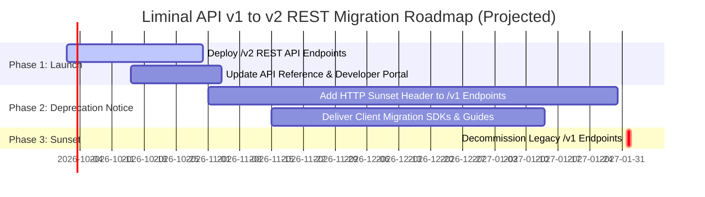

# Q3: RESTful API Standardization & Redesign

This document presents a comprehensive **RESTful API Architectural Redesign** for three legacy Liminal API endpoints identified in the Technical Writer Evaluation Assignment:

1. `https://docs.lmnl.app/reference/gettransfers` (`POST /api/wallet/get-transfer`)
2. `https://docs.lmnl.app/reference/sendmanytransaction` (`POST /api/wallet/send-many-transaction`)
3. `https://docs.lmnl.app/reference/getwalletbalance` (`POST /api/wallet/balance`)

---

## Architectural Audit & Non-RESTful Anti-Patterns

The three legacy endpoints violate standard REST architectural principles in several key areas:

### Identified Non-REST Anti-Patterns

```
1. VERB-IN-PATH & RPC-OVER-HTTP ANTI-PATTERN
   Legacy Docs:   GET/POST  /reference/gettransfers
   Legacy API:    POST      /api/wallet/get-transfer
   Legacy Docs:   POST      /reference/sendmanytransaction
   Legacy API:    POST      /api/wallet/send-many-transaction
   Legacy Docs:   GET/POST  /reference/getwalletbalance
   Legacy API:    POST      /api/wallet/balance
   Critique: In REST, the HTTP Verb (GET, POST, PUT, DELETE) defines the action. 
             Including verbs ("get", "send") in the URI and using HTTP POST for read-only 
             data queries creates RPC-style endpoints that prevent standard HTTP caching.

2. NON-PLURAL RESOURCE NOUNS & CONFLATED RESOURCES
   Legacy:  sendmanytransaction, getwalletbalance, get-transfer
   Critique: REST resources represent collections of entities and should use lowercase, 
             pluralized nouns (e.g. /transfers, /transactions, /wallets). Additionally, 
             the legacy /get-transfer endpoint conflates single-item lookup with data fetching.

3. LACK OF SUB-RESOURCE HIERARCHY
   Legacy:  POST /api/wallet/balance (passing wallet ID in body or query)
   Critique: Balances are dependent child attributes of a specific Wallet entity. 
             The URI structure should reflect the resource hierarchy (/wallets/{wallet_id}/balances).

4. INCONSISTENT ERROR SCHEMAS & MISSING IDEMPOTENCY
   Legacy:  Ad-hoc JSON error structures without standardized HTTP status codes or retry safety headers.
   Critique: Modern enterprise APIs mandate RFC 7807 problem details, HTTP 400/401/403 status codes, and Idempotency-Key headers for financial operations.
```

---

## The Redesigned REST API Suite

The matrix below maps each legacy endpoint to its standardized RESTful equivalent:

| Legacy Endpoint (Docs & API Route) | Redesigned RESTful Resource URI | HTTP Method | Resource Description |
| :--- | :--- | :---: | :--- |
| `POST /api/wallet/get-transfer` <br>`(/reference/gettransfers)` | `GET /v2/transfers/{tx_id}` <br>`GET /v2/transfers` | <span class="api-badge api-get">GET</span> | Retrieve a single transfer by ID or query a paginated collection. |
| `POST /api/wallet/send-many-transaction` <br>`(/reference/sendmanytransaction)` | `POST /v2/transfers/batch` | <span class="api-badge api-post">POST</span> | Create a new atomic multi-destination batch transfer resource. |
| `POST /api/wallet/balance` <br>`(/reference/getwalletbalance)` | `GET /v2/wallets/{wallet_id}/balances` | <span class="api-badge api-get">GET</span> | Fetch coin and token balances for a specific vault wallet resource. |

---

## Key Architectural Enhancements in v2

### 1. Prefixed Resource Identifiers (`vlt_`, `trsf_`, `btx_`)
In v2, all system entities use typed string prefixes (`vlt_14999` or `vlt_892341029384` for Vaults, `trsf_90812349120` for Transfers, `btx_89123049123` for Batches). Numeric IDs (e.g. `14999`) remain supported as string aliases for backward compatibility.

### 2. Idempotency & `sequenceId` Migration
In v1, clients passed a `sequenceId` in the JSON request body. In v2, financial mutation operations (`POST /v2/transfers/batch`) enforce standard HTTP headers: `Idempotency-Key: <UUIDv4>`. If a request body includes `sequenceId`, v2 treats it as a fallback idempotency key.

### 3. Unified Error Format Migration (v1 Envelope to v2 RFC 7807)
v2 endpoints adopt the **RFC 7807 Problem Details Specification** while preserving top-level HTTP status codes:
- **HTTP 400 Bad Request**: Validation failures and Cube3 Threat Screening blocks (`RISK_SCREENING_FAILED`).
- **HTTP 401 Unauthorized**: Missing or invalid API credentials.
- **HTTP 403 Forbidden**: Insufficient organization or role permissions.
- **HTTP 429 Too Many Requests**: Rate limit exceeded.

```json
{
  "type": "https://docs.lmnl.app/errors/address-threat-detected",
  "title": "Address Threat Blocked",
  "status": 400,
  "detail": "The transaction request was aborted because destination address 0xB9dF6D174d6f1f3A61484762E7131F46Ec85b0d1 exceeded the maximum allowed risk score threshold (Risk Score 89 > 80).",
  "instance": "/v2/transfers/batch",
  "code": "RISK_SCREENING_FAILED",
  "invalid_params": [
    {
      "name": "recipientsData.recipients[2].address",
      "reason": "Flagged by Cube3 Security Inspector with Risk Score 89 (Sanctioned / Malicious Activity)",
      "screening_id": 14825
    }
  ]
}
```

---

## Complete OpenAPI 3.0.0 Specification (Redesigned /v2/ REST Suite)

Below is the complete OpenAPI 3.0.0 definition containing full request/response schemas, error status codes (`400`, `401`, `403`, `429`, `500`), and parameter declarations:

```json
{
  "openapi": "3.0.0",
  "info": {
    "title": "Liminal REST API v2",
    "version": "2.0.0",
    "description": "Standardized RESTful API suite for Liminal digital asset custody, transfers, and wallet management."
  },
  "servers": [
    {
      "url": "https://docs.lmnl.app/v2"
    }
  ],
  "paths": {
    "/transfers": {
      "get": {
        "summary": "Retrieve Transfers Collection",
        "operationId": "ListTransfers",
        "parameters": [
          { "name": "wallet_id", "in": "query", "required": false, "schema": { "type": "string" }, "description": "Filter by wallet ID." },
          { "name": "sequence_id", "in": "query", "required": false, "schema": { "type": "string" }, "description": "Filter by sequence UUID." },
          { "name": "status", "in": "query", "required": false, "schema": { "type": "string" }, "description": "Filter by status: PENDING, COMPLETED, FAILED, BLOCKED." },
          { "name": "asset", "in": "query", "required": false, "schema": { "type": "string" }, "description": "Filter by asset symbol (e.g. ETH, SOL)." },
          { "name": "limit", "in": "query", "required": false, "schema": { "type": "integer", "default": 50 } },
          { "name": "starting_after", "in": "query", "required": false, "schema": { "type": "string" } }
        ],
        "responses": {
          "200": {
            "description": "Successful retrieval of transfer list",
            "content": { "application/json": { "schema": { "$ref": "#/components/schemas/TransferListResponse" } } }
          },
          "401": { "$ref": "#/components/responses/401Unauthorized" },
          "403": { "$ref": "#/components/responses/403Forbidden" },
          "500": { "$ref": "#/components/responses/500ServerError" }
        }
      }
    },
    "/transfers/{tx_id}": {
      "get": {
        "summary": "Retrieve a Single Transfer",
        "operationId": "GetTransfer",
        "parameters": [
          { "name": "tx_id", "in": "path", "required": true, "schema": { "type": "string" }, "description": "Transaction hash or transfer ID." }
        ],
        "responses": {
          "200": {
            "description": "Transfer details retrieved",
            "content": { "application/json": { "schema": { "$ref": "#/components/schemas/TransferObject" } } }
          },
          "404": { "description": "Transfer not found" }
        }
      }
    },
    "/transfers/batch": {
      "post": {
        "summary": "Create Batch Transfer",
        "operationId": "CreateBatchTransfer",
        "parameters": [
          {
            "name": "Idempotency-Key",
            "in": "header",
            "required": true,
            "schema": { "type": "string", "format": "uuid" },
            "description": "Unique key to prevent duplicate transaction executions."
          }
        ],
        "requestBody": {
          "required": true,
          "content": {
            "application/json": {
              "schema": { "$ref": "#/components/schemas/BatchTransferRequest" }
            }
          }
        },
        "responses": {
          "201": {
            "description": "Batch transfer created successfully",
            "content": { "application/json": { "schema": { "$ref": "#/components/schemas/BatchTransferResponse" } } }
          },
          "400": {
            "description": "Bad Request / Threat Screening Blocked",
            "content": { "application/json": { "schema": { "$ref": "#/components/schemas/ProblemDetails" } } }
          },
          "401": { "$ref": "#/components/responses/401Unauthorized" },
          "429": { "$ref": "#/components/responses/429RateLimited" }
        }
      }
    },
    "/wallets/{wallet_id}/balances": {
      "get": {
        "summary": "Retrieve Wallet Balances",
        "operationId": "GetWalletBalances",
        "parameters": [
          { "name": "wallet_id", "in": "path", "required": true, "schema": { "type": "string" } }
        ],
        "responses": {
          "200": {
            "description": "Wallet balances fetched successfully",
            "content": { "application/json": { "schema": { "$ref": "#/components/schemas/WalletBalancesResponse" } } }
          },
          "401": { "$ref": "#/components/responses/401Unauthorized" }
        }
      }
    }
  },
  "components": {
    "responses": {
      "401Unauthorized": {
        "description": "Unauthorized - Invalid or missing API Key",
        "content": { "application/json": { "schema": { "$ref": "#/components/schemas/ProblemDetails" } } }
      },
      "403Forbidden": {
        "description": "Forbidden - Insufficient permissions",
        "content": { "application/json": { "schema": { "$ref": "#/components/schemas/ProblemDetails" } } }
      },
      "429RateLimited": {
        "description": "Too Many Requests - Rate limit exceeded",
        "content": { "application/json": { "schema": { "$ref": "#/components/schemas/ProblemDetails" } } }
      },
      "500ServerError": {
        "description": "Internal Server Error",
        "content": { "application/json": { "schema": { "$ref": "#/components/schemas/ProblemDetails" } } }
      }
    },
    "schemas": {
      "BatchTransferRequest": {
        "type": "object",
        "required": ["wallet_id", "asset", "recipients"],
        "properties": {
          "wallet_id": { "type": "string", "example": "vlt_14999" },
          "asset": { "type": "string", "example": "ETH" },
          "screening_flag": { "type": "boolean", "default": false },
          "recipients": {
            "type": "array",
            "items": {
              "type": "object",
              "required": ["destination_address", "amount"],
              "properties": {
                "destination_address": { "type": "string", "example": "0x71C7656EC7ab88b098defB751B7401B5f6d8976F" },
                "amount": { "type": "string", "example": "1.500000" }
              }
            }
          }
        }
      },
      "BatchTransferResponse": {
        "type": "object",
        "properties": {
          "id": { "type": "string", "example": "btx_89123049123" },
          "object": { "type": "string", "example": "transfer_batch" },
          "status": { "type": "string", "example": "PROCESSING" },
          "asset": { "type": "string", "example": "ETH" },
          "total_amount": { "type": "string", "example": "2.250000" },
          "recipient_count": { "type": "integer", "example": 2 }
        }
      },
      "TransferObject": {
        "type": "object",
        "properties": {
          "id": { "type": "string", "example": "trsf_90812349120" },
          "wallet_id": { "type": "string", "example": "vlt_14999" },
          "amount": { "type": "string", "example": "1.500000" },
          "asset": { "type": "string", "example": "ETH" },
          "chain": { "type": "string", "example": "ETH" },
          "destination_address": { "type": "string", "example": "0x71C7656EC7ab88b098defB751B7401B5f6d8976F" },
          "status": { "type": "string", "example": "COMPLETED" },
          "tx_hash": { "type": "string", "example": "0xa38f12c45e98b71d23ef890214a1253a6b89e71239ab71230dff71238912384a" }
        }
      },
      "TransferListResponse": {
        "type": "object",
        "properties": {
          "object": { "type": "string", "example": "list" },
          "data": { "type": "array", "items": { "$ref": "#/components/schemas/TransferObject" } },
          "has_more": { "type": "boolean", "example": false }
        }
      },
      "WalletBalancesResponse": {
        "type": "object",
        "properties": {
          "object": { "type": "string", "example": "wallet_balance" },
          "wallet_id": { "type": "string", "example": "vlt_14999" },
          "vault_name": { "type": "string", "example": "Primary Hot Exchange Vault" },
          "balances": {
            "type": "array",
            "items": {
              "type": "object",
              "properties": {
                "asset": { "type": "string", "example": "ETH" },
                "coin": { "type": "string", "example": "eth" },
                "chain": { "type": "string", "example": "ETH" },
                "symbol": { "type": "string", "example": "ETH" },
                "total_balance": { "type": "string", "example": "150.750000" },
                "available_balance": { "type": "string", "example": "148.500000" },
                "staked_balance": { "type": "string", "example": "0.000000" },
                "pending_withdrawals": { "type": "string", "example": "2.250000" }
              }
            }
          }
        }
      },
      "ProblemDetails": {
        "type": "object",
        "required": ["title", "status", "detail"],
        "properties": {
          "type": { "type": "string", "example": "about:blank" },
          "title": { "type": "string", "example": "Bad Request" },
          "status": { "type": "integer", "example": 400 },
          "detail": { "type": "string", "example": "Invalid parameters or threat screening failed." },
          "instance": { "type": "string", "example": "/v2/transfers/batch" },
          "code": { "type": "string", "example": "RISK_SCREENING_FAILED" }
        }
      }
    }
  }
}
```

---

## API Migration & Deprecation Roadmap

To ensure zero disruption for existing exchange client integrations, Liminal implements a phased **Deprecation & Migration Roadmap**:



### HTTP Deprecation Headers

Legacy `/v1/` responses will include standard deprecation headers informing clients of the migration window:

```http
HTTP/1.1 200 OK
Deprecation: @1790812800
Sunset: Mon, 01 Feb 2027 00:00:00 GMT
Link: <https://docs.lmnl.app/v2/migration-guide>; rel="successor-version"
```
